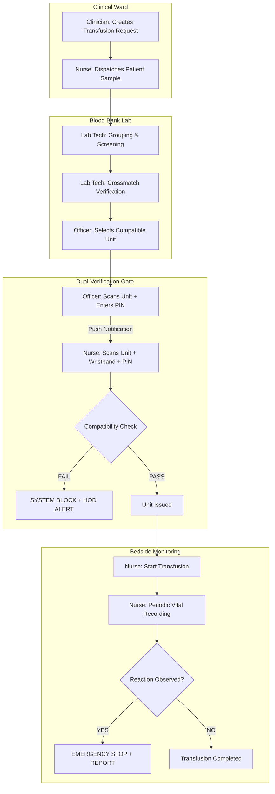

# TetherX Blood Bank — Transfusion Safety Management System

TetherX is a specialized, zero-trust clinical platform designed to manage hospital blood bank operations with an uncompromising focus on transfusion safety. It implements rigorous multi-stage verification workflows to eliminate human error in the "Vein-to-Vein" chain.

## 🚀 Key Features

- **Dual-Operator Issue Authorization**: Requires independent confirmation from both a Blood Bank Officer and a Ward Nurse before any blood unit can be issued.
- **ABO Compatibility Guardrails**: Hard-coded logic prevents authorization of ABO-incompatible units, automatically triggering forensic audit logs.
- **Real-Time Haemovigilance**: Dedicated interface for nurses to report adverse reactions, immediately quarantining units and alerting the Head of Department.
- **Forensic Audit Trail**: Every clinical action (scans, overrides, reactions, stock alerts) is recorded in an immutable, searchable ledger.
- **Role-Based Access Control (RBAC)**: Five distinct clinical roles (HOD, Officer, Lab Tech, Clinician, Nurse) with strictly partitioned data access.

---

## 🔐 Security & Compliance

TetherX is built on a **Zero-Trust Architecture** specifically tailored for clinical environments:

### 1. Multi-Factor Authentication (MFA)
- Required for all elevated administrative and laboratory roles (HOD, Officer, Lab Tech).
- Implemented via 6-digit TOTP verification following initial credential entry.

### 2. Physical Verification Loops
- **Barcode/Wristband Scanning**: The system requires physical scans of patient wristbands and unit barcodes at multiple points (Lab and Bedside) to ensure the right unit reaches the right patient.
- **Independent Validation**: Different staff members must execute verification steps on separate devices/panels to prevent "complacency bias."

### 3. Row-Level Security (RLS)
- Data is partitioned at the database layer using Supabase RLS policies:
    - **Ward Isolation**: Nurses can only see patients and issued units assigned to their specific ward.
    - **Ownership Isolation**: Clinicians only view requests they initiated.
    - **Elevated Read**: Only HODs can access the full forensic audit trail.

### 4. Forensic Logging
- Audit logs are **Insert-Only**. No API or user role (including HOD) has permission to `UPDATE` or `DELETE` audit entries, ensuring data integrity for medical-legal compliance.

---

## 🔄 User Workflow

TetherX follows a high-fidelity clinical lifecycle:



---

## 🛠️ Tech Stack

- **Framework**: [Next.js 15](https://nextjs.org/) (App Router)
- **Language**: TypeScript
- **Database**: [PostgreSQL](https://www.postgresql.org/) (via [Supabase](https://supabase.com/))
- **Auth**: [Supabase Auth](https://supabase.com/auth) with MFA and Role-based partitioning
- **Styling**: [Tailwind CSS](https://tailwindcss.com/)
- **Icons**: [Lucide React](https://lucide.dev/)

---

## 💻 Getting Started

### Prerequisites

- **Node.js**: v20 or higher
- **Supabase Account**: A project with the schema provided in `supabase_schema.sql` applied.

### 1. Setup Environment
Rename `.env.example` (if provided) or create a `.env.local` file in the root directory:

| Variable | Description |
|----------|-------------|
| `NEXT_PUBLIC_SUPABASE_URL` | Your Supabase Project URL |
| `NEXT_PUBLIC_SUPABASE_ANON_KEY` | Your Supabase Project Anon Key |

### 2. Initialize Database
Apply the schema and seed data via the Supabase SQL Editor:
1. Run `supabase_schema.sql` to create tables and RLS policies.
2. Run `supabase_seed.sql` to populate initial clinical data and demo users.

### 3. Install and Run
```bash
# Install dependencies
npm install

# Start development server
npm run dev
```

### 4. Admin Setup
To access administrative dashboards, log in with:
- **Email**: `hod@hospital.in`
- **Password**: `Demo@1234`
- **MFA Code**: Any 6 digits (for demo/hackathon version)

---

## 📁 Directory Structure

```text
├── src/
│   ├── app/                # Next.js App Router (Routes & Layouts)
│   │   ├── dashboard/      # Role-specific clinical dashboards
│   │   ├── issue-auth/     # Dual-verification gate interface
│   │   ├── adverse-reaction/ # Haemovigilance reporting
│   │   └── audit-trail/    # Forensic log viewer (HOD only)
│   ├── components/         # Reusable UI (Cards, Badges, Tables)
│   ├── lib/                # Database clients & session management
│   └── types/              # Clinical data interfaces (Request, Unit, Profile)
├── supabase_schema.sql     # DDL for clinical database architecture 
└── supabase_seed.sql       # Hackathon demo data
```

---

## 🎓 Hackathon Build
*Developed for VIT-TetherX Hackathon.* Focuses on demonstrating visual fidelity, critical safety guardrails, and real-world clinical role partitioning.
